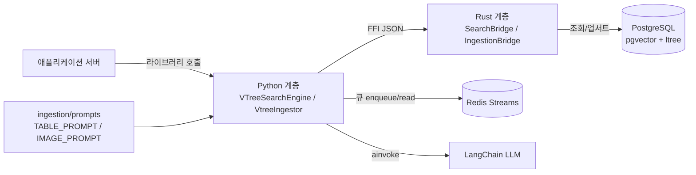
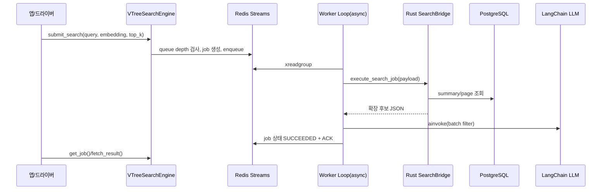
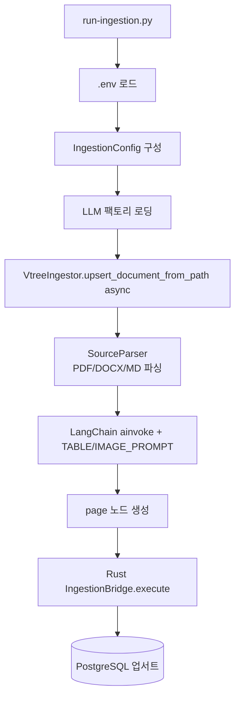

# Vtree Search

Vtree Search는 **Python 라이브러리 모드**로 동작하는 멀티모달 계층형 검색 엔진입니다.
애플리케이션 서버는 별도로 두고, 라이브러리는 검색/적재 실행 경로와 큐잉 제어를 담당합니다.

## 무엇을 하는 프로그램인가

- 검색: `VTreeSearchEngine`이 검색 잡을 Redis Streams에 적재하고 워커가 Rust 파이프라인을 실행한 뒤 LLM 필터를 적용합니다.
- 적재: `VtreeIngestor`가 문서를 파싱해 표/이미지 주석을 LLM으로 생성하고 summary/page 노드를 PostgreSQL로 업서트합니다.
- 멀티모달 파싱: PDF/DOCX/Markdown에서 텍스트, 표, 이미지를 추출해 `[TBL]`, `[IMG]` 블록으로 구조화합니다.

## 전체 동작 구조



## 검색 실행 흐름



## 적재 실행 흐름



## 부하 제어 기본값

- 큐 모델: Redis Streams + Consumer Group
- 보장: At-least-once
- 임계치: `QUEUE_MAX_LEN=200`, `QUEUE_REJECT_AT=180`
- 재시도: 3회, 지수 백오프(`200ms`~`2s`), 초과 시 DLQ
- 포화 시 예외: `QueueOverloadedError`

## `.env` 정책

- 라이브러리 본체는 `.env`를 직접 읽지 않습니다.
- 루트 `.env`는 드라이버 코드에서만 읽습니다.
  - [`scripts/run-search.py`](scripts/run-search.py)
  - [`scripts/run-ingestion.py`](scripts/run-ingestion.py)
- 샘플 키는 [`.env.example`](.env.example)을 사용합니다.
- LLM 연결 정보는 `.env`가 아니라 Python 팩토리(`--llm-factory`)에서 관리합니다.

## LLM 직접 주입 예시

```python
from langchain_openai import ChatOpenAI
from vtree_search import VTreeSearchEngine, VtreeIngestor

llm = ChatOpenAI(model="gpt-5-mini", temperature=0)
search_engine = VTreeSearchEngine(config=search_config, llm=llm)
ingestor = VtreeIngestor(config=ingestion_config, llm=llm)
```

`langchain-openai`, `langchain-google-genai`, `langchain-anthropic` 구현체를 그대로 사용할 수 있습니다.

## 디렉토리

```text
.
├── src_py/vtree_search/   # Python 공개 API/큐/파서/LLM 주입 인터페이스
├── src_rs/                # Rust 실행 계층
├── docs/                  # 아키텍처/모듈/운영 문서
└── scripts/               # .env 기반 드라이버
```

## 문서 바로가기

- 아키텍처 청사진: [`docs/arch/blueprint.md`](docs/arch/blueprint.md)
- 런타임 시퀀스: [`docs/arch/how-this-works.md`](docs/arch/how-this-works.md)
- 이론 배경: [`docs/arch/theoretical_background.md`](docs/arch/theoretical_background.md)
- 운영/SLO/큐잉: [`docs/ops/queueing-and-slo.md`](docs/ops/queueing-and-slo.md)
- Python 개요: [`docs/python/README.md`](docs/python/README.md)
- Python LLM 주입: [`docs/python/llm_injection.md`](docs/python/llm_injection.md)
- Python 레퍼런스: [`docs/python/module_reference.md`](docs/python/module_reference.md)
- Rust 개요: [`docs/rust/README.md`](docs/rust/README.md)
- Rust 레퍼런스: [`docs/rust/module_reference.md`](docs/rust/module_reference.md)

## 드라이버 실행 예시

### 검색 드라이버

```bash
uv run python scripts/run-search.py \
  --query "문서에서 환불 정책을 찾아줘" \
  --embedding "0.1,0.2,0.3,0.4" \
  --llm-factory app.llm_factories:create_search_llm \
  --top-k 5
```

### 적재 드라이버

```bash
uv run python scripts/run-ingestion.py \
  --document-id doc_001 \
  --parent-node-id sum_001 \
  --summary-node-id sum_001 \
  --summary-path doc_001.sum_001 \
  --summary-text "문서 요약" \
  --summary-embedding "0.1,0.2,0.3,0.4" \
  --input-root data/ingestion-doc \
  --llm-factory app.llm_factories:create_ingestion_llm \
  --sample
```

## 테스트 명령 핸드오프

- Python: `uv run pytest tests/python -m integration`
- Rust: `cargo test --test rust_tests`
